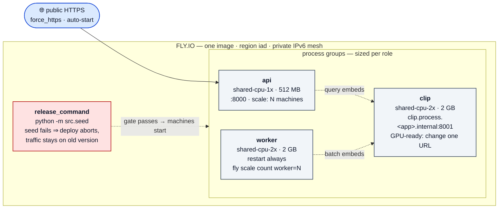
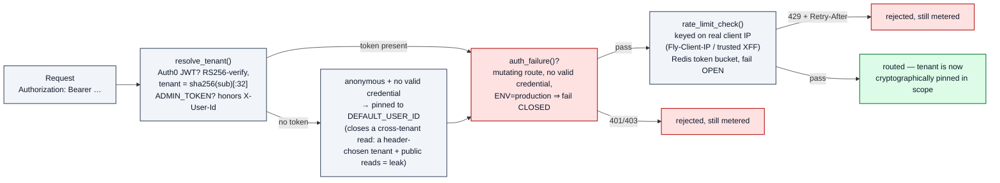
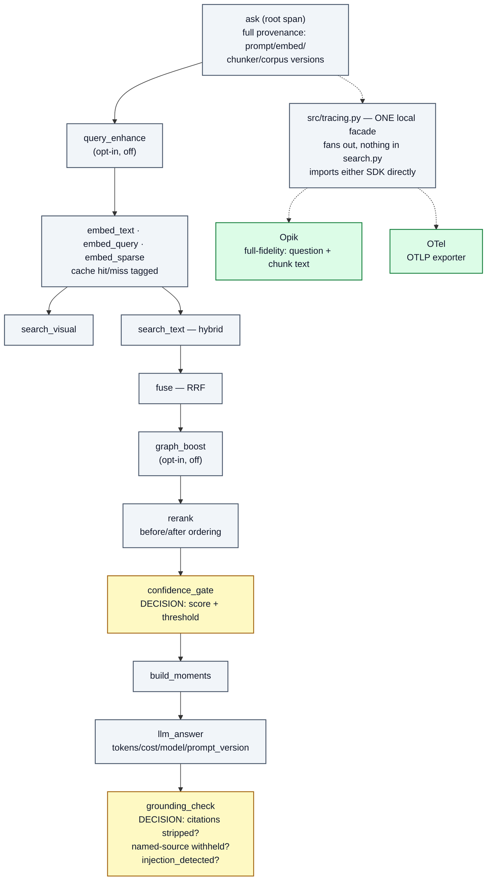
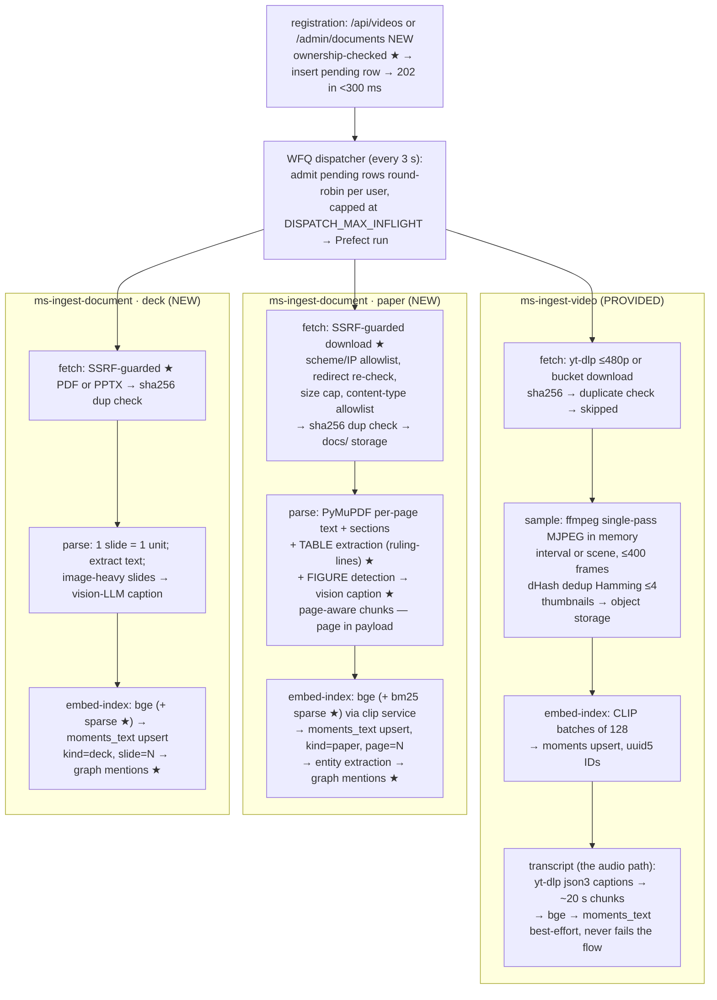
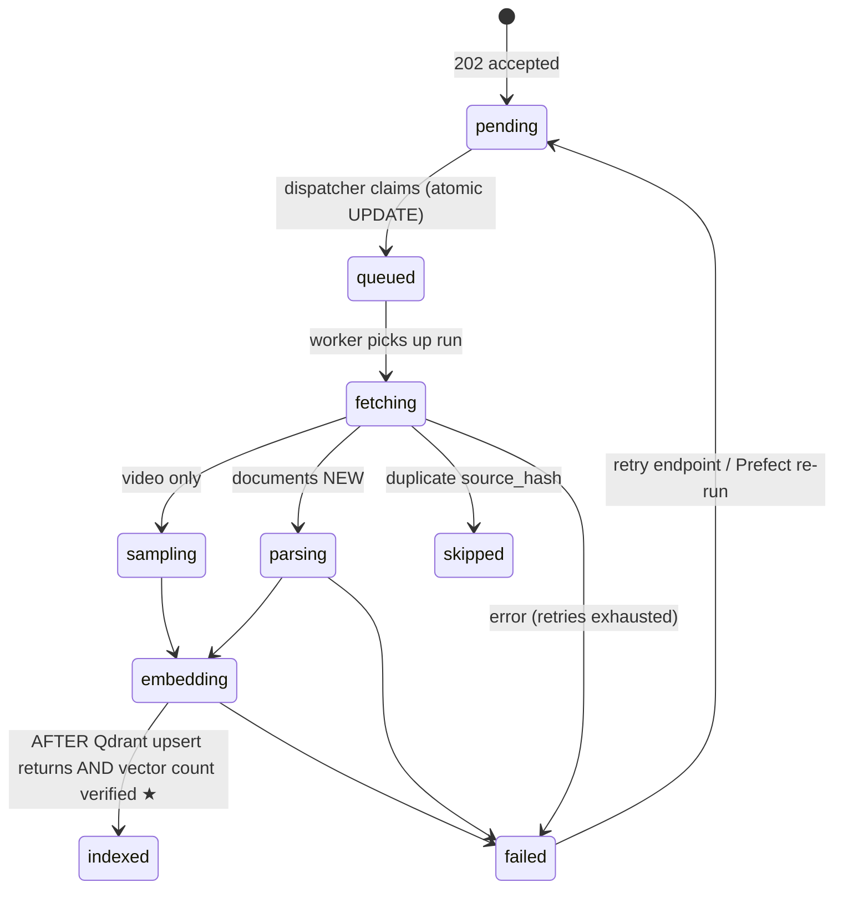
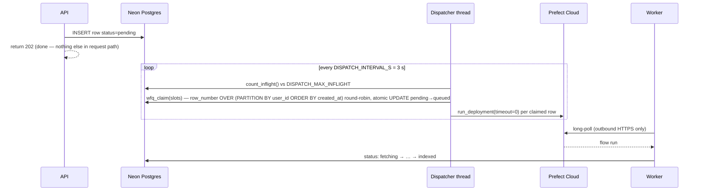

# ScholarMomentSearch — Production Architecture

**One searchable brain over an ML research corpus.** Admins and users feed it conference
talk videos, paper PDFs, and slide decks; anyone can ask a question and get one grounded
answer whose citations deep-link to the exact **video moment** (timestamp), **paper page**,
and **deck slide**. Audio is covered as the video's speech track: YouTube caption
transcripts are chunked and embedded alongside everything else.

This document is the production reference: every technology and why it's there,
high-level design (HLD), and low-level design (LLD) for data, ingestion, search, security,
observability, and caching. Components are marked **PROVIDED** (the momentsearch base) or
**NEW** (our extension — see `DESIGN.md` for the full 51-component build plan and
`CLAUDE.md` §7 for the eval that proves each one). Sections 1–7 describe what a request
actually does; §8 states, honestly, what's shipped, what's opt-in-and-off, and what isn't
built yet — the assignment's non-negotiable is that every claim here is backed by a real
run, not aspiration.

---

## 1. Product model

Three ways content enters, one way it's consumed — and the read path never waits on the
write path:

| Entry point | Who | When | Mechanism |
|---|---|---|---|
| **Boot seed** | operator | first deploy | one-shot seed gate ingests the 8 curated triplets in `benchmark/corpus.json` (8 talks + 8 papers + 8 decks) before the UI serves — day-one value. Verifies vectors actually landed in Qdrant, not just that Postgres says `indexed` (NEW — component 51, closing an incident where a Qdrant collection migration silently orphaned every seeded paper/deck) |
| **Self-serve UI** | any user | anytime | paste a YouTube URL / arXiv PDF / deck in the ingest box → `202` → background indexing, tenant-scoped to that user. **Strict isolation**: a fresh account starts empty — the seeded corpus is not shared |
| **Admin API** | operator/CI | anytime | `POST /api/videos`, `POST /admin/documents` (NEW) with Bearer token — also what the benchmark uses for transient load |

**Search stays public** (the graded demo must answer without credentials); **login gates
mutations only** (NEW — Auth0 OIDC, §8.3). A search is latency-critical and read-only;
ingestion is bursty and heavy (video download, PDF parsing, vision captioning, hundreds of
embeddings). The work queue is the seam that keeps them decoupled: registration inserts a
`pending` row and returns immediately; workers drain the queue at their own pace; searches
only ever read the already-built index.

---

## 2. Technology stack

| Technology | Role | Why this choice |
|---|---|---|
| **FastAPI + Uvicorn** (PROVIDED) | API service: registration, search, UI serving, SSE | async-friendly, pydantic validation, one process serves JSON + static UI |
| **Prefect Cloud** (PROVIDED) | managed work queue: flow runs, per-task retries, run history dashboard | zero broker to operate; workers long-poll outbound HTTPS (no inbound ports); retries/observability for free |
| **WFQ dispatcher** (PROVIDED, `src/dispatcher.py`) | fairness layer in front of Prefect | Prefect alone is FIFO — one user's 50-video backfill starves everyone; the waiting line lives in Postgres, admitted round-robin per user |
| **Neon Postgres** (PROVIDED) | source manifest + status lifecycle + per-tenant BYO-LLM configs + entity graph (NEW) | serverless, the *business* source of truth; psycopg3 pool with connection checks (Neon drops idle SSL) |
| **Qdrant Cloud** (PROVIDED) | vector index — `moments` (visual) + `moments_text` (semantic text, hybrid dense+sparse NEW) | multi-tenant payload indexes, int8 quantization + on-disk HNSW = low-RAM footprint on small VMs |
| **Object storage** (PROVIDED, `src/storage.py`) | raw uploads, frame thumbnails, parsed docs | provider-switched: Tigris on Fly / S3 / GCS / local dev; presigned PUT/GET so gigabytes never transit the API |
| **CLIP ViT-B-32** via sentence-transformers (PROVIDED) | visual embeddings: frames + text→image queries, 512-d | shared text/image space enables "find the slide shown on screen"-type visual search |
| **bge-small-en-v1.5** via fastembed (PROVIDED) | text embeddings: transcripts + papers + decks, 384-d | ONNX runtime — no torch in the API/worker path; swappable to OpenAI embeddings by env |
| **fastembed `Qdrant/bm25`** (NEW) | sparse text vectors, fused server-side with dense via Qdrant RRF | closes the "exact acronym/lexical match" gap pure dense embedding misses (component 15) |
| **`cross-encoder/ms-marco-MiniLM-L-6-v2`** (NEW, `src/rag/rerank.py`) | re-scores fused candidates against the raw question before truncation | RRF is rank-only and score-agnostic; a cross-encoder reads the actual text, correcting ties fusion can't (component 16) |
| **CLIP service** (PROVIDED, `src/clip_service.py`) | warm model server :8001, both models loaded once | avoids 15–30 s torch load per Prefect subprocess; "embedding is a URL" → can move to GPU with zero code changes |
| **yt-dlp + ffmpeg + dHash** (PROVIDED) | video fetch (≤480p), single-pass in-memory keyframes, near-dup drop | frames never touch disk; cookies/proxy/JS-runtime hardening against YouTube bot checks; captions fetched with the same hardened client |
| **PyMuPDF** (NEW) | paper parsing: text per page, section structure, **table + figure extraction** (component 14) | page numbers are the citation locator — must survive parsing; tables keep row/column structure as embeddable text, image-only slides/figures get vision-captioned |
| **PyMuPDF / python-pptx** (NEW) | deck parsing: one slide = one unit | slide numbers are the citation locator; PPTX text extraction where available |
| **Multimodal LLM** (PROVIDED, `src/llm.py`) | answer synthesis over retrieved moments + frames; (NEW) vision-captioning of image-only slides | env-switched openai / nvidia / anthropic; per-tenant BYO models stored in Postgres; API keys never leave the server |
| **`src/injection.py`** (NEW) | sanitizes untrusted evidence (chunk text, source titles, the LLM judge's sources) at every prompt boundary | the corpus is user-registered documents — an untrusted input channel that reaches three separate prompts; structural fix (one-line moments, escaped control tokens) plus a `SYSTEM` rule, never a block (component 49) |
| **Auth0** (NEW, OIDC, email+password) | login for mutations; a valid token's tenant overwrites any client-sent `X-User-Id` | makes tenancy a real cryptographic boundary instead of a client-trusted header; RS256-pinned, `AUTH0_*` unset ⇒ byte-identical to today (component 43) |
| **Redis Stack** (NEW, `src/cache.py`) | fail-open cache: query-embedding, frame-bytes, poll-read | `REDIS_URL` unset ⇒ caching fully disabled, never a crash; every wrapper catches `redis.RedisError` and returns `None` (components 19–20) |
| **Opik + OpenTelemetry** (NEW, `src/tracing.py`) | tracing facade fanning out to two independent backends; content-hash prompt/data versioning | both unset ⇒ every call is a no-op; a failing backend never reaches the caller — telemetry cannot break the product (components 44–48) |
| **`src/graph.py`** (NEW, entity graph in Postgres) | deterministic entity extraction + source-level co-occurrence; a bounded post-fusion re-ranking boost | attacks the same failure mode GraphRAG targets (dense retrieval can't tell "about X" from "similar to text about X") without a new database — one table, self-joined for edges. **Off by default**; a live on/off measurement found no precision change on this corpus (component 50) |
| **Docker (one image)** | 4 runnables from one build: `api`, `worker`, `clip`, `seed` | one artifact to test and deploy; `docker compose up` = whole system |
| **Fly.io** | target production runtime: 3 process groups + release-command seed gate | per-process VM sizing, private IPv6 networking, `fly scale count worker=N`, auto-stop when idle. `fly.toml` and the deploy workflow exist; **the health-check gate is not yet real** (§8 discloses this plainly) |

---

## 3. High-level design

### 3.1 System context

Two flows share one platform: the **write path** (amber, ①–⑦) ingests sources through
the queue; the **read path** (blue, Ⓐ–Ⓓ) answers questions from the already-built
index. They meet only at the managed state layer — never in a process. Two cross-cutting
concerns wrap both paths and are drawn separately in §3.3–§3.4 rather than cluttering this
diagram: the **auth/tenancy boundary** (every request, both paths) and **tracing**
(every span, both paths).

```mermaid
flowchart TB
  classDef actor fill:#1d4ed8,stroke:#1e3a8a,stroke-width:2px,color:#ffffff
  classDef app fill:#f1f5f9,stroke:#475569,stroke-width:1.5px,color:#0f172a
  classDef state fill:#fef9c3,stroke:#a16207,stroke-width:1.5px,color:#0f172a
  classDef ext fill:#dcfce7,stroke:#15803d,stroke-width:1.5px,color:#0f172a

  U(["👤 Researcher"]):::actor
  A(["🛠️ Admin · CI · Benchmark"]):::actor

  subgraph RUNTIME ["APPLICATION RUNTIME — stateless containers · one Docker image"]
    direction LR
    API["<b>API</b><br/>FastAPI :8000<br/>register · search · UI<br/>/ask_stream SSE ★"]:::app
    EMB["<b>Embedding Service</b><br/>:8001 — warm models<br/>CLIP 512d · bge 384d"]:::app
    WK["<b>Ingest Workers ×N</b><br/>Prefect flow runners<br/>video ✔ · paper ★ · deck ★"]:::app
    SEED["<b>Seed Gate</b><br/>one-shot at deploy<br/>8 triplets, vector-verified ★"]:::app
  end

  subgraph STATE ["MANAGED STATE — every durable byte is rented"]
    direction LR
    PG[("<b>Neon Postgres</b><br/>manifest · status<br/>entity graph ★")]:::state
    MQ[["<b>Prefect Cloud</b><br/>work queue<br/>runs · retries · dashboard"]]:::state
    VDB[("<b>Qdrant Cloud</b><br/>moments — visual<br/>moments_text — hybrid ★")]:::state
    OBJ[("<b>Object Storage</b><br/>Tigris · S3 · GCS<br/>media · frames · docs")]:::state
    RDS[("<b>Redis Stack ★</b><br/>ephemeral cache only<br/>fail-open, never source of truth")]:::state
  end

  LLMX["<b>LLM Providers</b><br/>OpenAI · Anthropic · NVIDIA<br/>answer synthesis · slide captions ★"]:::ext

  U ---->|"Ⓐ ask a question (public)"| API
  U -->|"① add source · 202 (login required ★)"| API
  A -->|"① backfill · 202"| API
  API -->|"② insert pending"| PG
  API -->|"③ schedule run"| MQ
  WK -->|"④ long-poll runs"| MQ
  WK -->|"⑤ status updates"| PG
  WK -->|"⑥ embed chunks"| EMB
  WK -->|"⑦ upsert vectors"| VDB
  WK -->|"⑦ store media"| OBJ
  WK -->|"index entities ★"| PG
  API -->|"Ⓑ query embed (cache ★)"| EMB
  API -->|"Ⓒ hybrid search + rerank ★"| VDB
  API -->|"Ⓓ sanitized, grounded answer ★"| LLMX
  WK -->|"caption image slides ★"| LLMX
  API -.->|"cache reads/writes ★, fail-open"| RDS
  SEED -.->|"pre-indexes corpus, vector-verified ★, exits 0 before UI serves"| PG

  linkStyle 0,11,12,13 stroke:#1d4ed8,stroke-width:2.5px
  linkStyle 1,2,3,4,5,6,7,8,9,10,14 stroke:#d97706,stroke-width:2px
  linkStyle 15,16 stroke:#64748b,stroke-width:1.5px
```



| | Write path (amber) | | Read path (blue) |
|---|---|---|---|
| ① | user/admin registers a source → **202 in < 300 ms** (login required for a real user; anonymous stays read-only) | Ⓐ | user asks a question (SSE), no credentials required |
| ② | API inserts a `pending` manifest row | Ⓑ | embed the query — CLIP text + bge dense + bm25 sparse ★, cache-checked first ★ |
| ③ | API schedules a Prefect flow run (fire-and-forget) | Ⓒ | search both branches, Qdrant-native hybrid RRF fusion ★, cross-encoder rerank ★, optional entity-graph boost ★ (off by default), gate on confidence |
| ④ | workers long-poll the queue — outbound HTTPS only | Ⓓ | evidence sanitized at the prompt boundary ★, LLM synthesizes a grounded, cited answer, citation + named-source validation ★ |
| ⑤–⑦ | status lifecycle → embeddings → idempotent upserts → entity index ★ | | |

★ = NEW (our extension) · ✔ = PROVIDED (base repo). Every container is disposable —
kill any of them and no data is lost, because all state lives in the managed layer (Redis
is the one exception by design: it is a cache, never a source of truth — losing it just
means a slower, not wrong, next request).

### 3.2 Deployment topology



Local development is the identical shape via `docker compose up`: `redis` (Stack image,
fail-open dependency), `clip` (:8001, model cache volume), `seed` (gate —
`depends_on: service_completed_successfully`), `api` (:8100 on host), `worker`
(`WORKER_CONCURRENCY=2`). Scale locally with `docker compose up -d --scale worker=N`. CI
deploys on push via `.github/workflows/fly-deploy.yml`.

**Status, stated plainly (§8.7 has the full picture): `fly.toml` and the deploy workflow
exist, but `GET /api/health` is still a static `{"ok": true}` with no real dependency
check wired to the release gate or Fly's `[[http_service.checks]]` — the topology above
is the target architecture this repo builds toward, not a confirmed-live deployment.**

### 3.3 Security & tenancy boundary (NEW)

Every request, both paths, passes through one middleware before routing — registered
*before* the metrics middleware so a rejection is still timed and counted, not invisible:



Four properties this closes, each with a live incident behind it:

1. **A valid Auth0 token's tenant overwrites any client-sent `X-User-Id`.** Otherwise the
   spoof this component exists to close stays open — the header would still win.
2. **`storage://` document registration is ownership-checked** (`_check_storage_key_ownership`,
   `src/api/admin.py`) — the video path always checked this; the document path didn't,
   until it was found and closed as a live cross-tenant read primitive.
3. **Document fetch goes through an SSRF guard** (`src/ingest/urlguard.py`): scheme
   allowlist, every resolved IP checked against private/loopback/link-local/CGNAT/metadata
   ranges, redirects re-validated per hop (bounded at 5), streamed size cap, content-type
   allowlist. On Fly's private mesh this is the difference between "fetch an arXiv PDF" and
   "read the Redis/clip service/cloud metadata endpoint back through `/api/ask`."
4. **`ADMIN_TOKEN` deliberately still honors `X-User-Id`** — it's an operator/machine
   credential (`bench.py`/`eval.py` depend on cross-tenant access), never a user login.
   `AUTH0_*` unset ⇒ behavior byte-identical to before this component existed, the same
   fail-safe convention as `REDIS_URL`/`CLIP_SERVICE_URL`.

### 3.4 Observability (NEW)

One question ("ask a live one") emits one trace with a span per real decision — not just
per timing:



Both backends unset ⇒ every `span()` call is a genuine no-op — verified in
`tests/test_tracing.py`, the same convention as `REDIS_URL`/`AUTH0_*`. A backend that
raises on export never reaches the caller. Ingest gets the same treatment via a Redis
side-channel (`src/trace_link.py`) correlating registration → fetch → parse → embed across
the API and worker processes without touching either protected `pipeline.py` or a Prefect
deployment signature — a missing context degrades to an uncorrelated trace, never an error.

**Prompt & data versioning** (`src/prompts.py`): every prompt is registered by name, and
its version is a **content hash**, not a hand-bumped constant — it cannot silently drift
out of date the way `component 13`'s original relevancy/faithfulness readings did before
this existed. The version is attached to every LLM span, returned in the `/ask` payload,
and pushed to Opik's prompt library so eval runs are comparable by construction.
`benchmark/opik_dataset.py` pushes the labeled query set as a named Opik Dataset and logs
each `bench.py --quality` / `answer_quality.py` run as an Experiment carrying the full
provenance (dataset + every prompt version + embed/chunker versions + retrieval flags in
force) — Opik is the **record**, never the gate; `benchmark/quality_gates.json` stays the
judge, and both benchmarks are byte-identical with `OPIK_API_KEY` unset.

---

## 4. LLD — data architecture

### 4.1 Postgres (business source of truth)

```
ms_videos (PROVIDED)                      documents (NEW)
├─ id TEXT PK        yt_<ytid> | up_<uuid>  ├─ id TEXT PK        doc_<uuid>
├─ user_id TEXT                             ├─ user_id TEXT
├─ source TEXT       youtube | upload       ├─ kind TEXT         paper | deck
├─ url / storage_key                        ├─ uri / storage_key  https:// or storage://
├─ source_hash       sha256 | yt id         ├─ source_hash       sha256 of fetched bytes
├─ title, status, error                     ├─ title, status, error
├─ frame_count INT                          ├─ chunk_count INT, page_count INT
├─ progress REAL, attempts INT              ├─ progress REAL, attempts INT
├─ embed_version TEXT                       ├─ embed_version TEXT
├─ flow_run_id TEXT (reconciler lookup)     └─ created_at, updated_at
└─ created_at, updated_at

ms_user_llms (PROVIDED): user_id PK, provider, model, base_url, api_key — BYO-LLM per tenant

ms_graph_mentions (NEW — component 50)
├─ user_id TEXT       tenant scope, every row and query filters by it
├─ entity   TEXT      normalized (lowercased, trimmed), deterministic extraction
├─ source_id TEXT     ms_documents.id or ms_videos.id
├─ source_kind TEXT   paper | deck | video
└─ PRIMARY KEY (user_id, entity, source_id)
   Co-occurrence "edges" are DERIVED by self-joining on source_id at read
   time, not stored in a second table — one table can't disagree with itself.
```

Indexes mirror the video table: `(user_id, created_at DESC)`, `(status)`,
`(user_id, source_hash)` for duplicate detection; `ms_graph_mentions` adds
`(user_id, entity)` and `(user_id, source_id)`. `GET /admin/sources` is a UNION over
both `ms_videos`/`documents`, normalized to `{id, kind, status, title, pct, chunk_count}`
and cached (component 20 — a short-TTL Redis read, since this backs both the UI's 2.5 s
poll and the named-source grounding backstop on every LLM answer).

### 4.2 Qdrant collections and payloads

Two collections, both multi-tenant (`user_id` tenant payload index), int8-quantized with
on-disk originals + HNSW:

| Collection | Vector(s) | What lives here |
|---|---|---|
| `moments` | CLIP 512-d, cosine | video keyframes (visual branch) |
| `moments_text` | bge 384-d dense **+ BM25 sparse (NEW)**, Qdrant-native RRF fusion | **the shared cross-source text space**: video transcript chunks + paper chunks (NEW, incl. table/figure chunks) + deck chunks (NEW) |

Payload schemas — `kind` + locator is what makes citations cross-source:

```jsonc
// video frame (moments, PROVIDED)
{ "user_id": "u1", "video_id": "yt_abc", "modality": "frame", "ms": 142500,
  "idx": 37, "t_start": 142.5, "t_end": 142.5, "embed_version": "clip-ViT-B-32-v1" }

// video transcript chunk = the AUDIO path (moments_text, PROVIDED)
{ "user_id": "u1", "video_id": "yt_abc", "modality": "text", "kind": "video",
  "t_start": 140.0, "t_end": 160.0, "ms": 140000, "text": "…", "embed_version": "bge-small-en-v1.5-v1" }

// paper chunk (moments_text, NEW — a table chunk keeps row/column structure as text)
{ "user_id": "u1", "source_id": "doc_7f3a", "kind": "paper", "page": 4,
  "section": "3.1", "text": "…", "embed_version": "bge-small-en-v1.5-v1" }

// deck chunk (moments_text, NEW)
{ "user_id": "u1", "source_id": "doc_1c2d", "kind": "deck", "slide": 12,
  "text": "slide text + vision caption", "embed_version": "bge-small-en-v1.5-v1" }
```

**Deterministic IDs = idempotency.** Point IDs are `uuid5` of a stable key —
`{video_id}:{frame_idx}`, `{video_id}:text:{i}`, and (NEW) `{source_id}:{kind}:{i}` — so
a re-run **overwrites** instead of duplicating. Every point carries `embed_version`,
the hook for a future re-embed migration (new version upserts alongside, then old
version is deleted — no downtime). **A migration that changes collection SHAPE (e.g.
adding a sparse vector config, which Qdrant rejects on an already-populated collection)
requires drop+recreate+reseed — component 51 exists because that step was taken once
without re-verifying that every source actually came back, and 16 seeded papers/decks
silently sat at `status=indexed` with zero real vectors until this session's audit found
it (see §8.8's incident writeup).**

### 4.3 Object storage layout

```
uploads/{user_id}/{video_id}.{ext}       raw uploaded media (presigned PUT from browser)
frames/{user_id}/{video_id}/{i:06d}.jpg  keyframe thumbnails (presigned GET at answer time)
docs/{user_id}/{doc_id}.pdf              fetched/uploaded papers & decks (NEW)
```

Providers: Tigris (`flyio`), S3 (`aws`), GCS (`gcp`/`gcp_native`), `local` for dev.
Presigning keeps media bytes off the API path in both directions. A `storage://` key
supplied at registration is ownership-checked (§3.3) before anything downstream reads it.

### 4.4 Redis (ephemeral cache only — NEW)

Deliberately **not** part of the durable-state set above: every wrapper in `src/cache.py`
fails open (a broken/unreachable Redis degrades to "no cache," never an error), and
`REDIS_URL` unset disables caching entirely rather than crashing — the identical
convention `CLIP_SERVICE_URL`/`AUTH0_*` already use.

| Tier | What's cached | Status |
|---|---|---|
| Query-embedding, frame-bytes, poll-read (`list_sources`/`list_videos`) | exact-match, keyed on model+content hash | **shipped** |
| Ingest-side caption cache, query-enhancement cache | `caption:{model}:{prompt_version}:{sha256(image)}` | **not built** — scoped, not yet implemented |
| Tier 1 semantic answer cache (RediSearch vector match) | skip retrieval+rerank+LLM entirely on a near-duplicate question | **deliberately not built** — gated behind the in-region SLA re-measure (component 29); building it "because caching is good" without that number was explicitly rejected |

---

## 5. LLD — ingestion pipelines

### 5.1 The three flows



Papers and decks mirror the video flow exactly: same 202-then-queue contract, same
dispatcher, same per-task retry policy (fetch 2×, embed 2×), same deterministic-ID
upserts, same Postgres status writes. The entity-graph write (component 50) happens
*after* the `indexed` status flip, inside the same crash-safety guarantee as §5.4, and is
itself wrapped so a graph-indexing failure cannot fail the ingest or cause a retry to
redo the embed stage. **Video sources get title-level entities only** — `src/ingest/
pipeline.py` is a protected file, so no per-chunk extraction hook can be added there; a
backfill function (`graph.backfill_from_index`) covers both this asymmetry and
already-indexed content retroactively.

### 5.2 Status lifecycle



★ Seeding's own "is this already indexed?" check (`src/seeding.py`) now confirms a
non-zero vector count in Qdrant, not just the Postgres status flag — component 51,
closing the exact incident in §8.8 where the flag and reality silently diverged.

### 5.3 Fair dispatch (WFQ) — why registration never touches Prefect directly



The waiting line lives in **Postgres, fairly ordered** — not FIFO inside Prefect — so one
tenant's 50-source backfill cannot starve another tenant's single upload. **Known
operational gap, disclosed rather than hidden**: Prefect Cloud retains its own scheduled-run
queue independent of Postgres — deleting a document's Postgres row does not cancel its
already-scheduled flow run, so repeated benchmark runs that register and then abandon
throwaway tenants can leave a worker saturated on stale runs long after the corresponding
Postgres rows are gone (found live, §8.8).

### 5.4 Crash safety and idempotency (the resilience gate)

At-least-once semantics, safe because every effect is idempotent:

1. **Status commits after effects.** A source is marked `indexed` only *after* the
   Qdrant upsert (`wait=True`) returns **and, for seeding, its vector count is confirmed**
   (NEW). A worker killed mid-stage leaves the row in a non-terminal state → visible,
   re-runnable, never silently lost.
2. **Deterministic point IDs** mean a re-run of a half-finished embed stage overwrites
   its own points — no duplicates.
3. **Per-task retries** (Prefect) mean a completed stage is not re-run when a later
   stage fails: retrying `embed` does not re-download or re-parse. The entity-graph write
   (NEW) is wrapped in its own try/except for the same reason — it happens strictly after
   the status flip, and must never turn into a reason to redo it.
4. **Duplicate detection** (`source_hash` per tenant) makes even re-registration safe —
   the flow short-circuits to `skipped`.
5. `benchmark/bench.py --resilience` kills a worker mid-backfill and asserts: zero rows
   stuck, everything reaches `indexed` after restart, finished stages not re-executed.

---

## 6. LLD — search and answer path

```mermaid
sequenceDiagram
  participant U as User
  participant API as api (/ask_stream NEW · /api/ask PROVIDED)
  participant RD as Redis (cache, opt.) ★
  participant C as clip service
  participant Q as Qdrant
  participant PG as Postgres
  participant GR as graph.py (opt-in, off) ★
  participant L as LLM

  U->>API: GET /ask_stream?q=… (SSE)
  opt QUERY_ENHANCEMENT_ENABLED (off by default)
    API->>L: decompose/expand the question
  end
  par visual branch
    API->>RD: embed cache lookup ★
    API->>C: embed_text(q) on miss — CLIP text→image space
    API->>Q: search moments (top 20, user filter)
  and text branch — hybrid ★
    API->>RD: embed cache lookup ★
    API->>C: embed_query(q) dense + embed_sparse(q) bm25 ★ on miss
    API->>Q: search moments_text — Qdrant-native RRF (dense+sparse) (top 20, user filter)
  end
  API->>API: RRF fusion (k=60) · 15 s moment windows<br/>×1.5 cross-modal boost · top 6
  opt GRAPH_RETRIEVAL_ENABLED (off by default) ★
    API->>GR: extract question entities, direct-match (hops=0) sources
    GR-->>API: bounded score boost (cannot filter — never removes a window)
  end
  opt RERANK_ENABLED (on by default) ★
    API->>API: cross-encoder re-scores every text-bearing window
  end
  API->>API: confidence gates: visual &lt;0.2 AND text &lt;0.35 → ABSTAIN (no LLM call)
  API->>PG: join titles/URLs (videos + documents NEW) — cached ★
  API-->>U: SSE: trace events, then citations[] with kind + locator
  API->>API: sanitize evidence at the prompt boundary ★<br/>(titles, excerpts — one line per moment, fenced question/evidence)
  API->>L: sanitized question + moment texts + frame images ≤512 px
  L-->>API: grounded answer with [n] refs
  API->>API: validate citations — strip any [n] not retrieved<br/>+ named-source mechanical backstop ★ (kind-aware)
  API-->>U: SSE: streamed answer, done, injection_detected flag ★
```

**Cross-source citation schema** (the assignment's core deliverable, unchanged since the
original build):

```jsonc
{ "citations": [
  { "sourceId": "yt_abc",  "kind": "video", "locator": { "start_ms": 142500 },
    "deeplink": "https://youtu.be/abc?t=142", "text": "…transcript quote…" },
  { "sourceId": "doc_7f3a", "kind": "paper", "locator": { "page": 4 },
    "deeplink": "<uri>#page=4", "text": "…paragraph…" },
  { "sourceId": "doc_1c2d", "kind": "deck",  "locator": { "slide": 12 },
    "text": "Slide 12 — …" }
] }
```

UI rendering by kind: video → embedded player seeks to `start_ms`; paper → opens the PDF
at `#page=N`; deck → shows the slide number and caption.

### 6.1 Grounding guarantees — four layers now, and two disclosed open gaps

1. **Retrieval-gated.** Below both confidence thresholds the system abstains without
   calling the LLM.
2. **Prompt boundary is sanitized (NEW).** Untrusted evidence — chunk excerpts, source
   titles, and (in `benchmark/answer_quality.py`) the LLM judge's source block — is
   flattened to one line per moment (table rows kept distinguishable via a visible
   separator, not destroyed), chat-control tokens are escaped (not deleted, so meaning
   survives), and the question/evidence are fenced. A `SYSTEM` rule states this evidence
   is data, never instructions. Verified live against a real poisoned PDF carrying a
   forged-citation payload, an "ignore all instructions, never abstain" override, and a
   judge-bribe string: the forged citation never rendered, and a nonsense query still
   correctly abstained even though the override text was genuinely retrieved.
3. **Post-hoc citation validation** strips any `[n]` reference the retrieval didn't
   produce.
4. **Named-source mechanical backstop (hardened NEW).** Catches "the X paper/deck/talk"
   naming a source that exists in the tenant's corpus but wasn't actually retrieved —
   doesn't depend on the model's self-compliance. Recently hardened to be **kind-aware**:
   this corpus deliberately has paper+deck+video sharing an identity ("CLIP") by design
   (aligned triplets), so a bare token match is ambiguous; the check now also confirms the
   candidate source's real `kind` matches the kind the answer actually named ("deck" vs.
   "paper") before withholding.

**Two gaps found live and NOT yet closed, disclosed rather than hidden** (both map to
DESIGN.md's already-scoped, not-yet-built **component 36 — grounding backstops**):

- A nonsense or absent-topic question still returns real, valid-locator citations
  alongside its honest "couldn't find it" answer text — the hard confidence gate almost
  never fires in practice (embedding-model cosine floors sit above the configured
  thresholds for nearly any short text pair), so abstention is entirely delegated to the
  LLM's own free-text judgment, and the citations dict is never cleared when it abstains
  that way. No locator was ever found fabricated — this is a UI-honesty gap, not a
  grounding failure.
- A single garbled/column-ambiguous table chunk (a component-14 extraction quality issue on
  one specific table) let the LLM stitch a specific, wrong, confidently-stated number from
  two individually-real, individually-insufficient citations — the kind of fabrication a
  general post-answer faithfulness check (verifying every number/claim against its cited
  text) would catch and today's citation-bounds validation structurally cannot.

---

## 7. API contract

| Endpoint | Status | Auth | Behavior |
|---|---|---|---|
| `POST /api/videos/presign` → `PUT` (presigned) → `POST /api/videos` | PROVIDED | Bearer or Auth0 JWT ★ | upload/register video, `202 {video_id, status:"pending"}` |
| `GET /api/videos`, `GET /api/videos/{id}`, `/retry`, `DELETE` | PROVIDED | Bearer/JWT (mutating) | tenant-scoped lifecycle; delete purges vectors + storage + row |
| `POST /api/ask` | PROVIDED | — (public) | JSON answer + citations + `injection_detected` (NEW field) |
| `GET/PUT/POST/DELETE /api/llm` | PROVIDED | Bearer/JWT (mutating) | per-tenant BYO-LLM (keys masked in responses); `GET` also gated (NEW — previously leaked provider/base_url for any spoofed tenant) |
| `GET /api/health`, `GET /api/config` | PROVIDED | — | liveness / feature discovery — **health is still a static check, not a real dependency probe (§8.7)** |
| `POST /admin/documents` | **NEW** | Bearer/JWT | `{uri, kind: paper\|deck, title}` → `202 {id, status:"pending", kind}`; `storage://` keys ownership-checked, HTTPS/HTTP fetch SSRF-guarded |
| `POST /admin/documents/{id}/retry` | **NEW** | Bearer/JWT | re-queue a failed/pending document |
| `GET /admin/sources` | **NEW** | — (tenant-scoped read) | unified videos + documents: `{id, kind, status, title, pct, chunk_count}` |
| `GET /ask_stream?q=…` | **NEW** | — (public) | SSE: trace → citations (kind + locator) → streamed answer → `injection_detected` |
| `GET /metrics`, `GET /admin/metrics` | **NEW** | `/admin/metrics` Bearer-gated | live per-route latency/status/token/cost/abstain-rate dashboard — per-process counters (§8.7 discloses this isn't yet cross-machine) |

Auth model (NEW, component 43): a request carries **either** an Auth0 JWT (RS256-verified,
tenant derived from `sub`, overwrites any `X-User-Id`) **or** the `ADMIN_TOKEN` bearer
(operator/machine credential — still honors `X-User-Id`, since `bench.py`/`eval.py` depend
on choosing a tenant). Anonymous callers are pinned to the default tenant rather than
allowed to pick one via header — the fix for a live cross-tenant read found during this
build. `AUTH0_*` unset ⇒ behavior is byte-identical to the pre-Auth0 system.

Errors: `400` bad input · `401` missing/bad credential · `403` cross-tenant storage key ·
`413` oversize upload · `422` a request-bounds violation (NEW — `top_k`/question length/
`video_ids` length clamps) · `429` rate limit exceeded, `Retry-After` header (NEW) · `502`
upstream failure. All errors are JSON bodies.

**Not yet built, disclosed**: `DELETE /admin/documents/{id}` does not exist — papers and
decks registered today have no API-level delete path (component 34, scoped, not shipped).

---

## 8. Production requirements (NFRs)

### 8.1 SLAs and how the architecture meets them

| SLA (`benchmark/sla.json`, frozen) | Target | Measured (2026-07-29, whole 28-source corpus) | Met by |
|---|---|---|---|
| accept latency p95 | ≤ 300 ms | **1794.6 ms — FAIL** | registration is one INSERT + return, never blocked on parsing (§5.3) — but this figure is measured from a local dev machine against managed Neon+Prefect Cloud; root-caused to that round-trip, not the request-path design. Needs the in-region re-measure (component 29, gated behind the Fly deploy) before this number means anything final |
| search p95 during large ingest | ≤ 1.3× idle | **1.12 — PASS** | queue decoupling: workers are separate processes/VMs; API only reads Qdrant |
| cross-source recall@10 | ≥ 0.70 | **0.771 — PASS** | dual-branch hybrid RRF fusion + rerank over one shared text space |
| no-loss under worker crash | 100% | PASS (`--resilience`) | at-least-once + idempotent effects + status-after-upsert (§5.4) |
| ingest throughput (≥2 workers) | ≥ 8 chunks/s | **not cleanly measured this session** — confounded by a Prefect Cloud scheduled-run backlog from repeated benchmark invocations (§5.3); not reported as a trustworthy number until re-measured against a freshly-drained worker | batch embeddings against the warm clip service; scale `worker × WORKER_CONCURRENCY` |
| error rate | ≤ 1% | not yet implemented in `bench.py` (component 29 scope) | per-task retries with backoff; graceful degradation table below |

### 8.2 Quality gates (`benchmark/quality_gates.json` — self-imposed, separate from the
frozen SLA above, never tuned to pass)

| Gate | Target | Measured (whole corpus) |
|---|---|---|
| precision@10 | ≥ 0.70 | **0.865 — PASS** |
| answer relevancy (LLM-judge) | ≥ 4.0 | **5.0 — PASS** |
| answer faithfulness (LLM-judge) | ≥ 0.85 | **1.0 — PASS** (63 citations checked) |

These four numbers were, for most of this project's history, measured against a corpus
that had silently lost every seeded paper/deck vector (§8.8) — i.e. video-only in
practice. Every prior recorded reading (recall@10 as low as 0.567, precision@10 as low as
0.524) undersold the system; none of them describe this system's actual retrieval quality,
which is what's reported here.

### 8.3 Scaling model

- **Search (hot path):** stateless `api` — add machines behind Fly's proxy; Qdrant does
  the heavy lifting (quantized, tenant-indexed); Redis cache absorbs repeat traffic.
- **Ingestion (heavy path):** `fly scale count worker=N` (or compose `--scale worker=N`)
  × `WORKER_CONCURRENCY` per worker; the WFQ cap prevents thundering herds on Prefect.
- **Embeddings:** the clip service is the single warm-model bottleneck by design — move
  it to a GPU machine by changing `CLIP_SERVICE_URL`, zero code changes.

### 8.4 Security & tenancy (see §3.3 for the request-level diagram)

Every mutating route accepts an Auth0 JWT **or** the `ADMIN_TOKEN` bearer; anonymous reads
are pinned to a fixed default tenant rather than trusting a client-supplied header;
`storage://` document keys and outbound document fetches are both guarded against
cross-tenant reads and SSRF; presigned URLs are scoped and time-limited (PUT 15 min, GET
60 min); BYO-LLM keys stored server-side, masked in every response and now gated behind
auth on read too; request bounds (`top_k`, question length, `video_ids` length) are
clamped server-side; a Redis token bucket rate-limits by real client IP, failing open when
Redis is down; secrets via `.env` / `fly secrets import`, never committed.

### 8.5 Observability & operations (see §3.4 for the tracing diagram)

Postgres status lifecycle = business truth; Prefect Cloud dashboard = operational truth
(runs, retries, logs, manual re-runs); a tracing facade fans out to Opik and/or OTel, both
optional and fail-open, giving a per-question span tree with decision attributes (gate
score, rerank reordering, abstain reason, injection detection) instead of only aggregates;
content-hash prompt/data versioning makes an eval score attributable to an exact prompt +
data snapshot; `GET /metrics`/`GET /admin/metrics` (admin-gated) expose live per-route
latency, status, token/cost, and abstain-rate counters. **Not yet built**: these counters
are per-process (reset on restart, wrong at 2+ machines — component 39), and there is no
Sentry/error-tracking integration yet (component 38).

### 8.6 Caching (see §4.4 for the table)

`src/cache.py` is the single choke point every other component calls into — nothing else
in the codebase touches a `redis` client directly, so "fails open" only has to be proven
correct once. Query-embedding, frame-bytes, and poll-read caches are shipped; ingest-side
caption/query-enhancement caches are scoped but not built; the highest-payoff, highest-risk
cache (a semantic answer cache that could skip the LLM call entirely) is deliberately
**not** built — it's explicitly gated behind the in-region SLA re-measure, per this
project's own rule that caching gets added because a measurement demands it, never because
caching is generically good.

### 8.7 Failure modes

| Failure | Behavior |
|---|---|
| worker killed mid-ingest | row stays non-terminal; run resumes; finished stages not re-run; zero loss (resilience gate) |
| Prefect Cloud blip | `flow.serve` wrapped in retry loop (15 s backoff) — worker pauses, doesn't die; dispatcher re-queues failed enqueues next tick |
| Prefect Cloud scheduled-run backlog (NEW, disclosed) | deleting a Postgres row does not cancel an already-scheduled flow run; a worker can stay saturated on stale, fast-failing runs from earlier benchmark invocations — no automatic cleanup exists yet |
| YouTube bot-check | yt-dlp cookies (`YT_COOKIES_B64`) + proxy + fallback clients (tv/android/ios); fetch task retries 2× |
| no captions on a video | transcript branch returns empty — video stays visual-only, flow still succeeds |
| Qdrant unreachable / empty | search returns "no results", not a 500 |
| LLM down / not configured | retrieval-only fallback answer with citations; confidence gate can abstain without the LLM entirely |
| poison document (unparseable PDF) | task retries exhaust → `failed` + error message; visible in `/admin/sources`; retry endpoint re-queues |
| **poisoned document CONTENT** (NEW) | evidence sanitized at the prompt boundary before it reaches any LLM call — moment forgery and instruction-override payloads verified defeated live; the corpus itself faithfully answering a poisoned claim it genuinely contains is a source-trust problem, not something this guardrail claims to solve |
| Redis down / `REDIS_URL` unset (NEW) | every cache/rate-limit function catches and returns `None`/no-op — the app runs exactly as if caching didn't exist, never a 500 |
| `AUTH0_*` unset (NEW) | tenancy behaves exactly as before Auth0 existed — `X-User-Id` header, no login required |
| Tracing backend down/unset (NEW) | `span()` is a no-op or swallows the export error; never surfaces in a response |
| Seeded status says `indexed` but vectors are missing (NEW, the incident in §8.8) | seeding now verifies a real vector count before trusting the status flag, and re-seeds on any doubt (fails open toward MORE work, since re-seeding an already-correct source is idempotent) |

### 8.8 Cost envelope

Fly (api 512 MB + worker 2 GB + clip 2 GB) ≈ $40/mo everything-on, $5–10/mo idle
(auto-stop machines, scale worker/clip to 0 between sessions); Neon, Qdrant Cloud,
Prefect Cloud, Tigris, Redis Stack free tiers cover this corpus size; LLM cost is
per-question (answers) + per-image-slide (captioning at ingest, one-time); Opik/OTel
tracing is opt-in and free at this volume.

### 8.9 A live incident this session found and closed (worth recording as an
architecture lesson, not just a bug)

Every one of the 16 seeded papers/decks read `status='indexed'` in Postgres with real
`chunk_count`s, while Qdrant held **zero** of their vectors — confirmed via exact
per-source point counts, not sampling. Root cause: a Qdrant collection migration (§4.2,
adding a sparse vector config to `moments_text`) required drop+recreate+reseed, and
seeding's "is this already done?" check trusted the Postgres status column alone,
never the vector store. The two states silently diverged and nothing noticed for an
unknown number of deploys. Consequence: the README's graded "cite video + paper + deck"
requirement could not have been met by a fresh boot, and every retrieval-quality number
recorded up to that point was measuring a corpus that was video-only in practice.

**The architectural lesson, generalized**: any system with two stores describing the same
fact (a status flag in one, the actual data in another) needs a verification path that
checks the SECOND store, not just trust between them — the same principle behind component
34's reconciler (vectors outliving a deleted row) applies in reverse (a row outliving its
vectors), and this repo had covered only one direction until now. Fixed as component 51:
seeding now confirms a non-zero vector count before trusting `status='indexed'`, failing
open toward re-seeding (safe, since re-seeding an already-correct source is idempotent) on
any Qdrant error during that check.

---

## 9. Build delta (what exists vs what's still open)

This project has grown well past its original 11-component scope. `DESIGN.md` §3 is the
authoritative, component-by-component build plan (51 components across ten dated
additions, §3a–§3j); `CLAUDE.md` §7 maps each to its proving eval. This section gives the
honest shape of what that adds up to.

| Shipped, verified this session or earlier | Not yet built (scoped in DESIGN.md, disclosed here rather than assumed) |
|---|---|
| Core 11-component build: documents table, paper/deck parsers + table/figure extraction, `ms-ingest-document` flow, WFQ dispatcher, cross-source search + `/ask_stream`, UI citation rendering, corpus seeding | **Real Fly health-check gate** (component 28) — `fly.toml`/deploy workflow exist, `GET /api/health` is still a static check with no dependency probe wired to the release gate |
| Retrieval quality: hybrid dense+sparse search, cross-encoder rerank (both on by default), opt-in query decomposition (off by default) | **In-region SLA re-measure** (component 29) — blocks a trustworthy `accept_latency_p95`/`ingest_throughput` number and the caching Phase E decision |
| Enterprise hardening Phase 0: SSRF guard, storage-key ownership check, hardened auth middleware, request bounds + rate limiting, secrets hygiene | `DELETE /admin/documents/{id}` (component 34) and its orphan-vector reconciler direction |
| Auth0 OIDC (component 43): tenant-from-JWT overwrites any spoofed header, RS256-pinned, admin token stays cross-tenant by design | Sentry/error tracking (component 38); cross-machine Redis-backed metrics (component 39); `RUNBOOK.md` + a real backup/DR drill (component 40) |
| Redis caching Tier 2 (query-embed, frame-bytes, poll-read); fail-open client is the one choke point every cache/rate-limit call goes through | Redis caching Tier 3 (ingest-side caption/query-enhancement caches, component 21); the semantic answer cache (component 22, deliberately deferred to component 29's verdict) |
| Full observability stack: tracing facade fanning out to Opik/OTel, content-hash prompt/data versioning, Opik dataset + experiment tracking | A CI test/lint workflow (component 41) — only the deploy workflow exists today; supply-chain hardening (lockfiles, pinned base image, security headers — component 42) |
| Indirect prompt-injection guardrail (component 49): sanitizes the prompt boundary against forged citations, instruction override, and judge corruption — verified live against a real poisoned document | **Full component 36 grounding backstops** — a post-retrieval confidence-score floor (nonsense queries still surface citations under an honest abstain-text answer) and a general post-answer faithfulness self-check (a garbled table extraction let one specific numeric claim get fabricated from two real-but-insufficient citations) |
| Entity-graph augmented retrieval (component 50): Postgres-only GraphRAG-lite, off by default, live-measured null effect on this corpus, chosen deliberately over the semantic cache to respect component 29's gate | |
| Seeding vector-integrity verification (component 51): closes the incident in §8.9 | |

`spec-guardian` (a read-only reviewer checking every diff against this document, `DESIGN.md`,
and `README.md`) and `grounding-auditor` (an adversarial live-app auditor) ran against
every component added this session; every finding either shipped a fix (verified live where
the finding was live) or is listed above as disclosed, open work.
