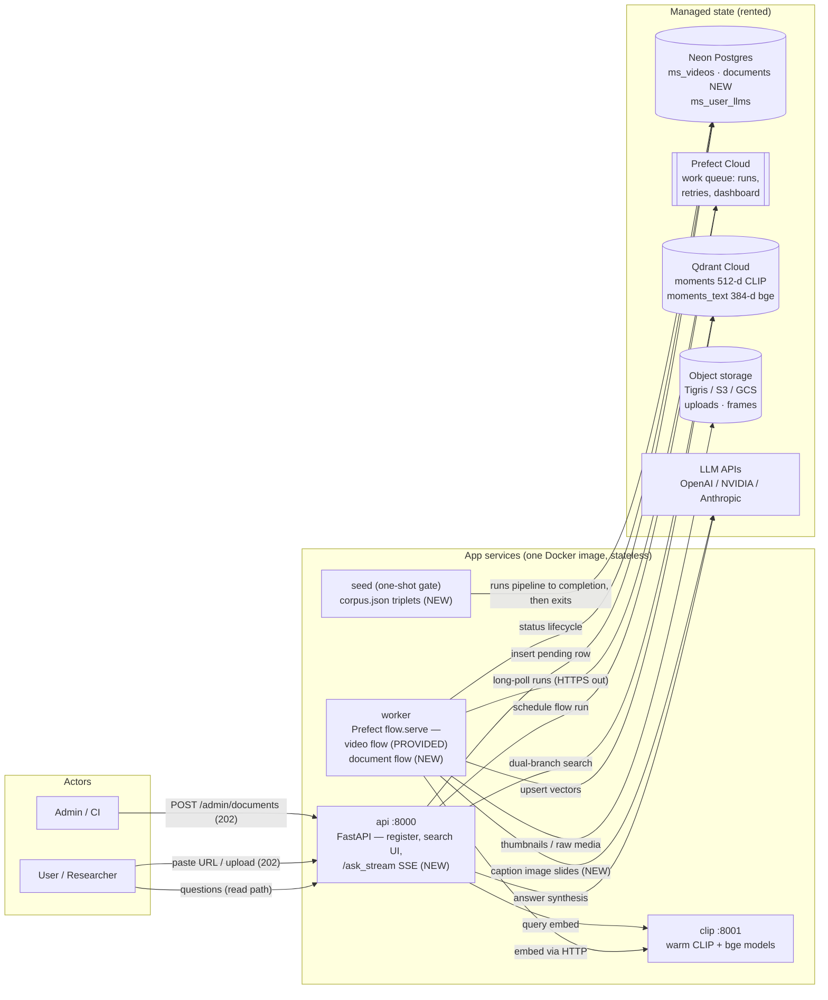
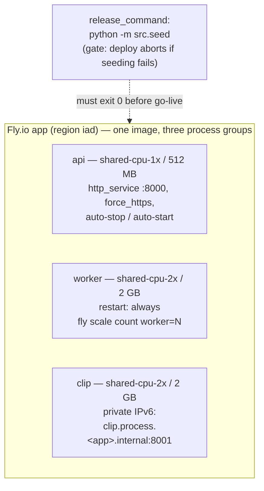
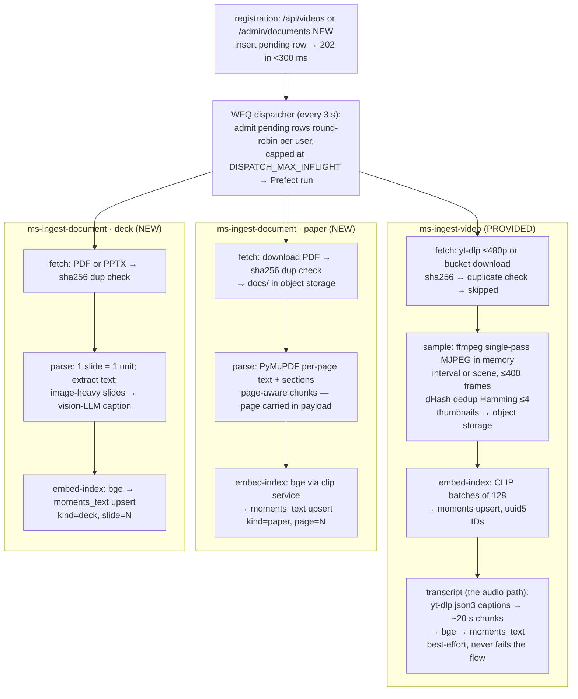
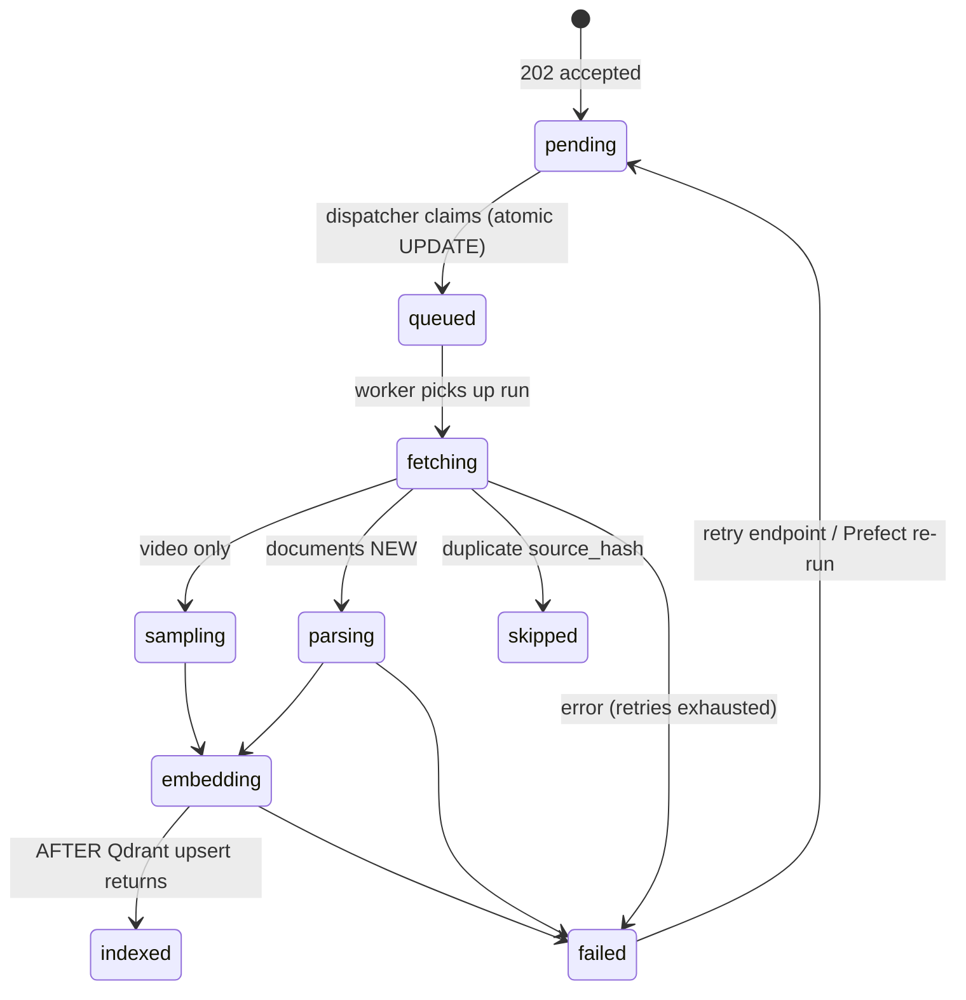
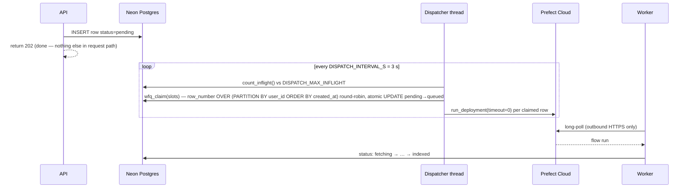

# ScholarMomentSearch — Production Architecture

**One searchable brain over an ML research corpus.** Admins and users feed it conference
talk videos, paper PDFs, and slide decks; anyone can ask a question and get one grounded
answer whose citations deep-link to the exact **video moment** (timestamp), **paper page**,
and **deck slide**. Audio is covered as the video's speech track: YouTube caption
transcripts are chunked and embedded alongside everything else.

This document is the production reference: every technology and why it's there,
high-level design (HLD), and low-level design (LLD) for data, ingestion, and search.
Components are marked **PROVIDED** (the momentsearch base) or **NEW** (our extension —
see `DESIGN.md` for the build plan).

---

## 1. Product model

Three ways content enters, one way it's consumed — and the read path never waits on the
write path:

| Entry point | Who | When | Mechanism |
|---|---|---|---|
| **Boot seed** | operator | first deploy | one-shot seed gate ingests the 8 curated triplets in `benchmark/corpus.json` (8 talks + 8 papers + 8 decks) before the UI serves — day-one value |
| **Self-serve UI** | any user | anytime | paste a YouTube URL / arXiv PDF / deck in the ingest box → `202` → background indexing, tenant-scoped to that user |
| **Admin API** | operator/CI | anytime | `POST /api/videos`, `POST /admin/documents` (NEW) with Bearer token — also what the benchmark uses for transient load |

A **search is latency-critical and read-only; ingestion is bursty and heavy** (video
download, PDF parsing, vision captioning, hundreds of embeddings). The work queue is the
seam that keeps them decoupled: registration inserts a `pending` row and returns
immediately; workers drain the queue at their own pace; searches only ever read the
already-built index.

---

## 2. Technology stack

| Technology | Role | Why this choice |
|---|---|---|
| **FastAPI + Uvicorn** (PROVIDED) | API service: registration, search, UI serving, SSE | async-friendly, pydantic validation, one process serves JSON + static UI |
| **Prefect Cloud** (PROVIDED) | managed work queue: flow runs, per-task retries, run history dashboard | zero broker to operate; workers long-poll outbound HTTPS (no inbound ports); retries/observability for free |
| **WFQ dispatcher** (PROVIDED, `src/dispatcher.py`) | fairness layer in front of Prefect | Prefect alone is FIFO — one user's 50-video backfill starves everyone; the waiting line lives in Postgres, admitted round-robin per user |
| **Neon Postgres** (PROVIDED) | source manifest + status lifecycle + per-tenant BYO-LLM configs | serverless, the *business* source of truth; psycopg3 pool with connection checks (Neon drops idle SSL) |
| **Qdrant Cloud** (PROVIDED) | vector index — `moments` (visual) + `moments_text` (semantic text) | multi-tenant payload indexes, int8 quantization + on-disk HNSW = low-RAM footprint on small VMs |
| **Object storage** (PROVIDED, `src/storage.py`) | raw uploads, frame thumbnails, parsed docs | provider-switched: Tigris on Fly / S3 / GCS / local dev; presigned PUT/GET so gigabytes never transit the API |
| **CLIP ViT-B-32** via sentence-transformers (PROVIDED) | visual embeddings: frames + text→image queries, 512-d | shared text/image space enables "find the slide shown on screen"-type visual search |
| **bge-small-en-v1.5** via fastembed (PROVIDED) | text embeddings: transcripts + papers + decks, 384-d | ONNX runtime — no torch in the API/worker path; swappable to OpenAI embeddings by env |
| **CLIP service** (PROVIDED, `src/clip_service.py`) | warm model server :8001, both models loaded once | avoids 15–30 s torch load per Prefect subprocess; "embedding is a URL" → can move to GPU with zero code changes |
| **yt-dlp + ffmpeg + dHash** (PROVIDED) | video fetch (≤480p), single-pass in-memory keyframes, near-dup drop | frames never touch disk; cookies/proxy/JS-runtime hardening against YouTube bot checks; captions fetched with the same hardened client |
| **PyMuPDF** (NEW) | paper parsing: text per page, section structure | page numbers are the citation locator — must survive parsing |
| **PyMuPDF / python-pptx** (NEW) | deck parsing: one slide = one unit | slide numbers are the citation locator; PPTX text extraction where available |
| **Multimodal LLM** (PROVIDED, `src/llm.py`) | answer synthesis over retrieved moments + frames; (NEW) vision-captioning of image-only slides | env-switched openai / nvidia / anthropic; per-tenant BYO models stored in Postgres; API keys never leave the server |
| **Docker (one image)** | 4 runnables from one build: `api`, `worker`, `clip`, `seed` | one artifact to test and deploy; `docker compose up` = whole system |
| **Fly.io** | production runtime: 3 process groups + release-command seed gate | per-process VM sizing, private IPv6 networking, `fly scale count worker=N`, auto-stop when idle |

---

## 3. High-level design

### 3.1 System context



Everything in the app box is stateless and disposable; every arrow to the managed box is
the only place state lives. Kill any container and nothing is lost.

### 3.2 Deployment topology



Local development is the same shape via `docker compose up`: services `clip`, `seed`
(gate: `restart: "no"`, `depends_on: service_completed_successfully`), `api` (:8100 on
host), `worker` (`WORKER_CONCURRENCY=2`). Scale locally with
`docker compose up -d --scale worker=3`. CI deploys on push via
`.github/workflows/fly-deploy.yml`.

---

## 4. LLD — data architecture

### 4.1 Postgres (business source of truth)

```
ms_videos (PROVIDED)                      documents (NEW)
├─ id TEXT PK        yt_<ytid> | up_<uuid>  ├─ id TEXT PK        doc_<uuid>
├─ user_id TEXT                             ├─ user_id TEXT
├─ source TEXT       youtube | upload       ├─ kind TEXT         paper | deck
├─ url / storage_key                        ├─ uri / storage_key  https:// or storage://
├─ source_hash       sha256 | yt id         ├─ source_hash       sha256 of fetched bytes
├─ title, status, error                     ├─ title, status, error
├─ frame_count INT                          ├─ chunk_count INT, page_count INT
├─ progress REAL, attempts INT              ├─ progress REAL, attempts INT
├─ embed_version TEXT                       ├─ embed_version TEXT
└─ created_at, updated_at                   └─ created_at, updated_at

ms_user_llms (PROVIDED): user_id PK, provider, model, base_url, api_key — BYO-LLM per tenant
```

Indexes mirror the video table: `(user_id, created_at DESC)`, `(status)`,
`(user_id, source_hash)` for duplicate detection. `GET /admin/sources` (NEW) is a UNION
over both tables normalized to `{id, kind, status, title, pct}`.

### 4.2 Qdrant collections and payloads

Two collections, both multi-tenant (`user_id` tenant payload index), int8-quantized with
on-disk originals + HNSW:

| Collection | Vector | What lives here |
|---|---|---|
| `moments` | CLIP 512-d, cosine | video keyframes (visual branch) |
| `moments_text` | bge 384-d, cosine | **the shared cross-source text space**: video transcript chunks + paper chunks (NEW) + deck chunks (NEW) |

Payload schemas — `kind` + locator is what makes citations cross-source:

```jsonc
// video frame (moments, PROVIDED)
{ "user_id": "u1", "video_id": "yt_abc", "modality": "frame", "ms": 142500,
  "idx": 37, "t_start": 142.5, "t_end": 142.5, "embed_version": "clip-ViT-B-32-v1" }

// video transcript chunk = the AUDIO path (moments_text, PROVIDED)
{ "user_id": "u1", "video_id": "yt_abc", "modality": "text", "kind": "video",
  "t_start": 140.0, "t_end": 160.0, "ms": 140000, "text": "…", "embed_version": "bge-small-en-v1.5-v1" }

// paper chunk (moments_text, NEW)
{ "user_id": "u1", "source_id": "doc_7f3a", "kind": "paper", "page": 4,
  "section": "3.1", "text": "…", "embed_version": "bge-small-en-v1.5-v1" }

// deck chunk (moments_text, NEW)
{ "user_id": "u1", "source_id": "doc_1c2d", "kind": "deck", "slide": 12,
  "text": "slide text + vision caption", "embed_version": "bge-small-en-v1.5-v1" }
```

**Deterministic IDs = idempotency.** Point IDs are `uuid5` of a stable key —
`{video_id}:{frame_idx}`, `{video_id}:text:{i}`, and (NEW) `{source_id}:{kind}:{i}` — so
a re-run **overwrites** instead of duplicating. Every point carries `embed_version`,
the hook for a future re-embed migration (new version upserts alongside, then old
version is deleted — no downtime).

### 4.3 Object storage layout

```
uploads/{user_id}/{video_id}.{ext}       raw uploaded media (presigned PUT from browser)
frames/{user_id}/{video_id}/{i:06d}.jpg  keyframe thumbnails (presigned GET at answer time)
docs/{user_id}/{doc_id}.pdf              fetched/uploaded papers & decks (NEW)
```

Providers: Tigris (`flyio`), S3 (`aws`), GCS (`gcp`/`gcp_native`), `local` for dev.
Presigning keeps media bytes off the API path in both directions.

---

## 5. LLD — ingestion pipelines

### 5.1 The three flows



Papers and decks mirror the video flow exactly: same 202-then-queue contract, same
dispatcher, same per-task retry policy (fetch 2×, embed 2×), same deterministic-ID
upserts, same Postgres status writes.

### 5.2 Status lifecycle



### 5.3 Fair dispatch (WFQ) — why registration never touches Prefect directly



The waiting line lives in **Postgres, fairly ordered** — not FIFO inside Prefect — so one
tenant's 50-source backfill cannot starve another tenant's single upload.

### 5.4 Crash safety and idempotency (the resilience gate)

At-least-once semantics, safe because every effect is idempotent:

1. **Status commits after effects.** A source is marked `indexed` only *after* the
   Qdrant upsert (`wait=True`) returns. A worker killed mid-stage leaves the row in a
   non-terminal state → visible, re-runnable, never silently lost.
2. **Deterministic point IDs** mean a re-run of a half-finished embed stage overwrites
   its own points — no duplicates.
3. **Per-task retries** (Prefect) mean a completed stage is not re-run when a later
   stage fails: retrying `embed` does not re-download or re-parse.
4. **Duplicate detection** (`source_hash` per tenant) makes even re-registration safe —
   the flow short-circuits to `skipped`.
5. `benchmark/bench.py --resilience` kills a worker mid-backfill and asserts: zero rows
   stuck, everything reaches `indexed` after restart, finished stages not re-executed.

---

## 6. LLD — search and answer path

```mermaid
sequenceDiagram
  participant U as User
  participant API as api (/ask_stream NEW · /api/ask PROVIDED)
  participant C as clip service
  participant Q as Qdrant
  participant PG as Postgres
  participant L as LLM

  U->>API: GET /ask_stream?q=… (SSE)
  par visual branch
    API->>C: embed_text(q) — CLIP text→image space
    API->>Q: search moments (top 20, user filter)
  and text branch
    API->>C: embed_query(q) — bge query prompt
    API->>Q: search moments_text (top 20, user filter)
  end
  API->>API: RRF fusion (k=60) · 15 s moment windows<br/>×1.5 cross-modal boost · top 6
  API->>API: confidence gates: visual &lt;0.2 AND text &lt;0.35 → ABSTAIN (no LLM call)
  API->>PG: join titles/URLs (videos + documents NEW)
  API-->>U: SSE: trace events, then citations[] with kind + locator
  API->>L: question + moment texts + frame images ≤512 px
  L-->>API: grounded answer with [n] refs
  API->>API: validate citations — strip any [n] not retrieved
  API-->>U: SSE: streamed answer, done
```

**Cross-source citation schema** (NEW — the assignment's core deliverable):

```jsonc
{ "citations": [
  { "sourceId": "yt_abc",  "kind": "video", "locator": { "start_ms": 142500 },
    "deeplink": "https://youtu.be/abc?t=142", "text": "…transcript quote…" },
  { "sourceId": "doc_7f3a", "kind": "paper", "locator": { "page": 4 },
    "deeplink": "<uri>#page=4", "text": "…paragraph…" },
  { "sourceId": "doc_1c2d", "kind": "deck",  "locator": { "slide": 12 },
    "text": "Slide 12 — …" }
] }
```

UI rendering by kind: video → embedded player seeks to `start_ms`; paper → opens the PDF
at `#page=N`; deck → shows the slide number and caption. (NEW tab in the same ingest box
lets users add papers/decks exactly like YouTube URLs today.)

**Grounding guarantees** (three independent layers): (1) retrieval-gated — below both
confidence thresholds the system abstains without calling the LLM; (2) the LLM only ever
sees retrieved moments, and the system prompt forbids outside knowledge; (3) post-hoc
citation validation strips any `[n]` reference the retrieval didn't produce. Empty
retrieval returns empty citations — never an invented page or timestamp.

---

## 7. API contract

| Endpoint | Status | Auth | Behavior |
|---|---|---|---|
| `POST /api/videos/presign` → `PUT` (presigned) → `POST /api/videos` | PROVIDED | Bearer | upload/register video, `202 {video_id, status:"pending"}` |
| `GET /api/videos`, `GET /api/videos/{id}`, `/retry`, `DELETE` | PROVIDED | Bearer (mutating) | tenant-scoped lifecycle; delete purges vectors + storage + row |
| `POST /api/ask` | PROVIDED | — | JSON answer + citations (kept unchanged) |
| `GET/PUT/POST/DELETE /api/llm` | PROVIDED | Bearer (mutating) | per-tenant BYO-LLM (keys masked in responses) |
| `GET /api/health`, `GET /api/config` | PROVIDED | — | liveness / feature discovery |
| `POST /admin/documents` | **NEW** | Bearer | `{uri, kind: paper\|deck, title}` → `202 {id, status:"pending", kind}` — **returns before any parsing** |
| `GET /admin/sources` | **NEW** | Bearer | unified videos + documents: `{id, kind, status, title, pct}` |
| `GET /ask_stream?q=…` | **NEW** | — | SSE: trace → citations (kind + locator) → streamed answer |

Errors: `400` bad input · `401` missing/bad Bearer · `413` oversize upload · `502`
upstream failure. All errors are JSON bodies. Tenancy: `X-User-Id` header on every
request (swap for real auth later — rows and vectors are already tenant-tagged).

---

## 8. Production requirements (NFRs)

### 8.1 SLAs and how the architecture meets them

| SLA (`benchmark/sla.json`) | Target | Met by |
|---|---|---|
| accept latency p95 | ≤ 300 ms | registration = one INSERT + return; parsing never in request path (§5.3) |
| search p95 during large ingest | ≤ 1.3× idle | queue decoupling: workers are separate processes/VMs; API only reads Qdrant |
| cross-source recall@10 | ≥ 0.70 | dual-branch RRF fusion over one shared text space; labeled query set over the 8 seeded triplets |
| no-loss under worker crash | 100% | at-least-once + idempotent effects + status-after-upsert (§5.4) |
| ingest throughput (≥2 workers) | ≥ 8 chunks/s | batch embeddings against the warm clip service; scale `worker × WORKER_CONCURRENCY` |
| error rate | ≤ 1% | per-task retries with backoff; graceful degradation table below |

### 8.2 Scaling model

- **Search (hot path):** stateless `api` — add machines behind Fly's proxy; Qdrant does
  the heavy lifting (quantized, tenant-indexed).
- **Ingestion (heavy path):** `fly scale count worker=N` (or compose `--scale worker=N`)
  × `WORKER_CONCURRENCY` per worker; the WFQ cap prevents thundering herds on Prefect.
- **Embeddings:** the clip service is the single warm-model bottleneck by design — move
  it to a GPU machine by changing `CLIP_SERVICE_URL`, zero code changes.

### 8.3 Security & tenancy

Bearer `ADMIN_TOKEN` on every mutating route; `X-User-Id` tenant scoping on rows,
vectors (Qdrant tenant payload index), and storage keys; presigned URLs are scoped and
time-limited (PUT 15 min, GET 60 min), server-minted keys only; BYO-LLM keys stored
server-side, masked in every response; secrets via `.env` / `fly secrets import`, never
committed (`.gitignore` enforces; benchmark checks staged files).

### 8.4 Observability & operations

Postgres status lifecycle = business truth (surfaced in the UI library panel and
`GET /admin/sources`); Prefect Cloud dashboard = operational truth (runs, retries, logs,
manual re-runs); `GET /api/health` for probes; the seed gate makes deploys atomic — a
failed seed aborts the release and traffic stays on the old version.

### 8.5 Failure modes

| Failure | Behavior |
|---|---|
| worker killed mid-ingest | row stays non-terminal; run resumes; finished stages not re-run; zero loss (resilience gate) |
| Prefect Cloud blip | `flow.serve` wrapped in retry loop (15 s backoff) — worker pauses, doesn't die; dispatcher re-queues failed enqueues next tick |
| YouTube bot-check | yt-dlp cookies (`YT_COOKIES_B64`) + proxy + fallback clients (tv/android/ios); fetch task retries 2× |
| no captions on a video | transcript branch returns empty — video stays visual-only, flow still succeeds |
| Qdrant unreachable / empty | search returns "no results", not a 500 |
| LLM down / not configured | retrieval-only fallback answer with citations; confidence gate can abstain without the LLM entirely |
| poison document (unparseable PDF) | task retries exhaust → `failed` + error message; visible in `/admin/sources`; retry endpoint re-queues |

### 8.6 Cost envelope

Fly (api 512 MB + worker 2 GB + clip 2 GB) ≈ $40/mo everything-on, $5–10/mo idle
(auto-stop machines, scale worker/clip to 0 between sessions); Neon, Qdrant Cloud,
Prefect Cloud, Tigris free tiers cover this corpus size; LLM cost is per-question
(answers) + per-image-slide (captioning at ingest, one-time).

---

## 9. Build delta (what exists vs what we add)

| Provided by the base repo | We build (NEW) |
|---|---|
| video ingest flow (frames + transcript), Prefect deployment, WFQ dispatcher, retries | `documents` table; `paper.py` + `deck.py` parsers; `ms-ingest-document` flow with the same lifecycle |
| `/api/videos` registration + presigned uploads, tenant model, BYO-LLM | `POST /admin/documents`, `GET /admin/sources` |
| dual-branch RRF search, confidence gates, grounded LLM answers, citation validation | `GET /ask_stream` SSE; `kind` + locator (`page`/`slide`) through retrieval → citations → UI |
| sample-video seed gate, one-image Docker/compose/Fly deploy | seed extended to `corpus.json` triplets; UI "Paper/Deck" ingest tab; benchmark TODOs (recall set, load, crash test) |

Component-by-component plan with file paths: see `DESIGN.md` (11 components, build order).
