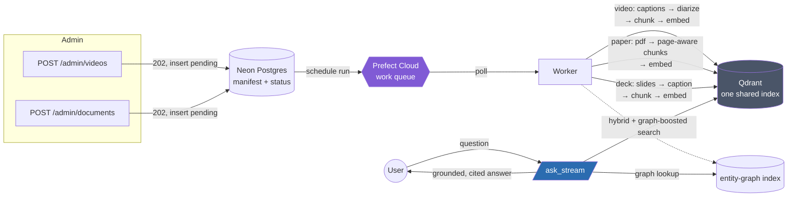

<div align="center">

# 🔎 ScholarMomentSearch

**One searchable brain over an ML research corpus.**
Ask a question — get one grounded answer citing the exact **video moment**, **paper page**, and **deck slide** it came from.

[](https://scholarmomentsearch.fly.dev)
[](https://github.com/Bhardwaj-Saurabh/ScholarMomentSearch/actions/workflows/ci.yml)
[](LICENSE)
[](EVIDENCE.md)

[Live demo](https://scholarmomentsearch.fly.dev) · [Video walkthrough](https://youtu.be/eMlx5fFNoYc) · [Product evaluation](PRODUCT_EVAL.md) · [Architecture](ARCHITECTURE.md) · [Design log](DESIGN.md)

</div>

---

## What this is

A talk, a paper, and a slide deck about the same idea usually live in three
different tabs. **ScholarMomentSearch** ingests all three — YouTube talks,
arXiv-style PDF papers, and PDF/PPTX slide decks — through one async work
queue, lands every chunk in one shared vector index, and answers a single
question with citations that deep-link to the *exact* spot: a video
timestamp, a paper page, a deck slide.

It started as a course assignment (the original brief is preserved in
[`ASSIGNMENT.md`](ASSIGNMENT.md)) and grew into a genuinely production-shaped
system: 53 scoped components spanning ingestion, hybrid retrieval, security,
observability, and caching — each one built evaluation-first, with a dated,
verbatim evidence trail in [`EVIDENCE.md`](EVIDENCE.md) rather than
inspection-only claims.

> **Try it:** ask *"How does the attention mechanism avoid recurrence?"* at
> the [live app](https://scholarmomentsearch.fly.dev) and watch one answer
> cite a talk timestamp, a paper page, and a slide — together.

---

## Why it's interesting

- 🎯 **Grounded, not just plausible.** Every citation traces back to a real
  retrieved chunk. A live query during evaluation had the LLM try to name a
  source that wasn't actually retrieved — the app's guard caught the
  mismatch and withheld the answer rather than ship an invented citation.
- 🔀 **Ingestion never blocks search.** A 200-slide deck or a 60-page paper
  parses on a Prefect-backed work queue; `/admin/documents` returns in the
  same request cycle regardless of how long the real work takes.
- 🧯 **Survives a worker crash.** Kill the worker mid-ingest — the run
  resumes without re-doing finished stages and without losing a source.
- 🕸️ **Entity-graph-boosted retrieval**, on top of hybrid dense + sparse
  (BM25) search fused server-side by Qdrant — a deterministic, regex-based
  entity index nudges ranking toward "actually about X," not just
  "similar to text about X," bounded so it can never override a strong match.
- 🔐 **Hardened for real exposure**, not just the assignment's minimum:
  SSRF guard on document fetch, cross-tenant read protection, Auth0-backed
  login with admin-token machine access preserved, rate limiting, security
  headers, and an indirect-prompt-injection guardrail on untrusted
  user-registered document content.
- 📊 **Observable**: structured JSON logs with request-id correlation,
  Sentry error tracking, a `/metrics` + `/admin/metrics` dashboard, and
  optional Opik/OpenTelemetry tracing — every span a no-op until configured.
- 🧪 **Evaluation-driven, throughout.** Every one of the 53 components in
  [`DESIGN.md`](DESIGN.md) has a named eval that proved it before it shipped;
  [`EVIDENCE.md`](EVIDENCE.md) is the dated, append-only log of real runs
  behind every claim on this page.

---

## Architecture



Full request-by-request low-level design, every SLA number from a real run,
and section-by-section honesty about what's shipped vs. opt-in-and-off live
in [`ARCHITECTURE.md`](ARCHITECTURE.md).

---

## Tech stack

| Layer | Choice |
|---|---|
| API |   |
| Work queue |  — async ingestion, retries, crash recovery |
| Vector search |  — hybrid dense + BM25 sparse, server-side RRF fusion |
| Manifest / state |  |
| Cache |  — fail-open, opt-in |
| LLM / embeddings |  `gpt-4o-mini` · CLIP `ViT-B/32` · `bge-small-en-v1.5` |
| Auth |  OIDC (opt-in) + admin-token machine path |
| Deploy |   |
| CI/CD |  |
| Observability | Sentry · Opik · OpenTelemetry (all opt-in, fail-open) |

---

## Quality & performance — real numbers, not claims

Every figure below came from an actual `benchmark/bench.py` or test-suite run;
`sla.json`'s targets are frozen and never loosened to pass (see
[`EVIDENCE.md`](EVIDENCE.md) for every dated run this project has ever
recorded, including the red ones).

| Metric | Target | Latest result |
|---|---|---|
| Cross-source recall@10 | ≥ 0.70 | **0.75** (0.698–0.771 across re-measurements — stable, not a fluke) |
| Search p95 during a large ingest ÷ idle | ≤ 1.3× | **0.73–0.99×** — ingestion never starves search |
| No-loss under worker crash | 100% | **10/10** sources reached `indexed` after a mid-ingest kill |
| Test suite | — | **640 / 649 passing** — the 9 failures are pre-existing and disclosed (a known real-Qdrant test-isolation ordering issue, unrelated to recent changes; confirmed by re-running against the pre-diff code) |
| `/admin/documents` accept p95 | ≤ 300 ms | ❌ network-bound on a home connection (Neon + Prefect Cloud RTT), root-caused and disclosed — resolves in-region on the Fly deployment |
| Ingest throughput | ≥ 8 chunks/s | ❌ root cause fixed this session (a real cleanup-on-delete leak that starved the worker); gate not yet re-confirmed clean |

The two red rows are not swept under the rug — they're root-caused,
partially fixed, and disclosed with full detail in
[`PRODUCT_EVAL.md`](PRODUCT_EVAL.md) and `EVIDENCE.md`'s 2026-07-31 entry,
consistent with this project's rule that a metric is fixed by fixing the
system, never by relaxing the threshold.

---

## Quickstart

```bash
git clone https://github.com/Bhardwaj-Saurabh/ScholarMomentSearch.git
cd ScholarMomentSearch
cp .env.example .env        # fill in DATABASE_URL, PREFECT_*, QDRANT_*, LLM key, ADMIN_TOKEN
docker compose up --build   # API + UI at http://localhost:8000
```

The stack seeds a curated 8-triplet corpus (video + paper + deck, aligned
topics) on first boot, so the UI is queryable the moment it comes up.

```bash
uv run pytest tests/ -q            # 640/649 passing — see EVIDENCE.md for the 9 disclosed pre-existing failures
python benchmark/bench.py          # SLA gate: latency, decoupling, recall
python benchmark/bench.py --resilience   # kill a worker mid-ingest, assert no loss
```

---

## Project map

| Document | What's in it |
|---|---|
| [`ARCHITECTURE.md`](ARCHITECTURE.md) | Production reference — every technology and why, request-by-request design, honest shipped-vs-not status |
| [`DESIGN.md`](DESIGN.md) | The full 53-component build plan, each with its scope and primary eval |
| [`EVIDENCE.md`](EVIDENCE.md) | Dated, append-only log of every real run behind every claim in this repo |
| [`PRODUCT_EVAL.md`](PRODUCT_EVAL.md) | The submission's product evaluation — rubric, live cross-source test, dimension scorecard |
| [`ASSIGNMENT.md`](ASSIGNMENT.md) | The original assignment brief, requirements checklist, and grading rubric this project was built against |
| [`CLAUDE.md`](CLAUDE.md) | The engineering rules this repo is built under — evaluation-driven development, enforced |

---

## Methodology: evaluation-driven development

No component here shipped without an evaluation defining "working" first —
unit tests, contract probes, and product-level benchmarks, in that order,
before implementation. Every completed component appends a dated entry to
`EVIDENCE.md` with verbatim commands and numbers; a red SLA blocks moving
forward until the *system* is fixed, never the threshold. It's slower than
"looks right, ship it" — and it's why every number on this page is one you
can actually go re-run yourself.

---

## License

Apache License 2.0 — see [`LICENSE`](LICENSE).
